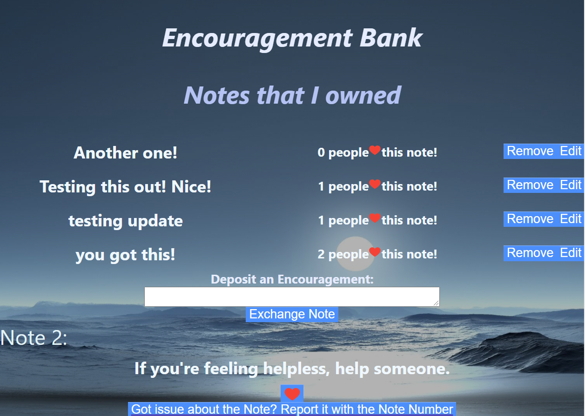

# Encouragement-Bank

An app that allows you to write some encouragement for others and in exchange you receive a note from others. 

## Motivation

During COVID time, many people had talked about their need to be encouraged. I am hoping to help in some degree.

## Screenshots
Examples:




## Features

* Exchange an encouragement note
* Liked a encouragement note
* See what you have written how many people liked them
* Delete or edit what you wrote
* Report inapporpriate content

## Demo

- [Live Demo](https://encouragement-exchange.johnhaoxianz.vercel.app/)

# Express Server!

This is the server repo for the app

## Installing
Install the dependencies and devDependencies and start the server.

```
npm install
```
## API endpoint

- [Link](https://tranquil-citadel-21990.herokuapp.com)

## Schema

### User

```js
{"id":"2000effb-903f-4a57-9c02-b91ba825b509","username":"testa","email":"test1@test.com","serialid":1}
```

### Note

```js
{"id":3,"content":"you got this!","liked":2,"user_id":1}
```
## API Overview

```text
/
.
├── /users
│   └── GET
│   └── GET /:id
│   └── POST
│ 
├── /notes
│   └── GET
│   └── GET /:id    
│   └── Post
│   └── Patch /:id
│   └── Delete /:id
│    
```
### GET `/users/:id` or `/notes/:id`

```js
// req.params
{
  id: ID
}
```
### POST `/users`

```js
// req.body
{
  email: String,
  username: String
}

// res.body
{
  id: uuid,
  email: String,
  username: String,
  serialid: integer
}
```
### POST `/notes`

```js
// req.body
{
  content: String,
  user_id: Integer,
  Liked: Integer
}

// res.body
{
  id: uuid,
  content: String,
  user_id: Integer,
  Liked: Integer
}
```
## Built With

* HTML
* CSS
* Postgres
* Express
* React
* Node

## Author

* **Haoxian Zhang** 